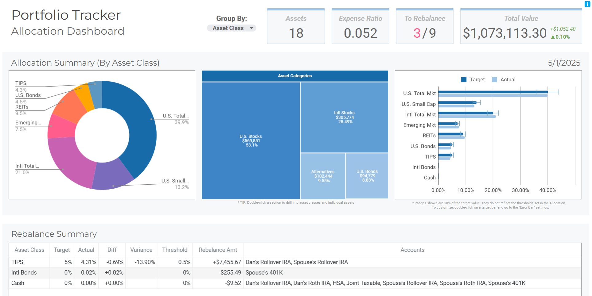

# Portfolio Tracker

Portfolio Tracker is a free Google Sheet designed for asset allocation tracking and simplified rebalancing.

Download the latest version: [Releases](https://github.com/danbuchal/portfolio-tracker/releases)

## Key Features

* **Interactive Dashboards:** Visualize your asset allocation and accounts at a glance and gain valuable insights into your portfolio's composition.
* **Near Real-Time Quotes:** Stay up-to-date with market data (delayed up to 20 minutes).
* **Organized Table Views:** Pre-defined views help you quickly analyze your holdings from different perspectives.
* **Collapsible Column Groups:** Show or hide detailed information as needed, keeping your view clean and focused.
* **Multiple Classes / Asset**: Track allocation of funds/assets having more than one asset class (e.g. Target Date Funds).
* **Completely Free:** Portfolio Tracker is FREE to use.  
  If you wish to support its development, buy me a coffee!

  

## The Story Behind Portfolio Tracker

Over ten years ago, I created the first version of Portfolio Tracker for my personal use. I shared it with Rob Berger (former owner of DoughRoller), and the response was incredible! He generously shared it with his audience, and it became the top Google search result for "[Best Investment Tracking Spreadsheet](https://www.google.com/search?q=best+investment+tracking+spreadsheet)".  Rob has featured it in numerous articles, [podcasts](http://traffic.libsyn.com/doughroller/DR_179--Free_Investment_Tracking_Spreadsheet.mp3?dest-id=168596) and YouTube [videos](https://youtu.be/l8vrmBIzICE?si=tEFLBzc8b_WzA7Jl).  You can find Rob's version [here](https://robberger.com/investment-tracking-spreadsheet/).

## Reimagined for Today

Leveraging the latest features available in Google Sheets, Portfolio Tracker was completely rebuilt from the ground up in late 2024. This new version offers a more powerful, intuitive, and flexible way to manage your portfolio. The goal remains the same: to provide you with clarity and control over your asset allocation.

## Stay Updated

Be sure to star this repository to stay up-to-date!
You will find new releases [here](https://github.com/danbuchal/portfolio-tracker/releases).

## Feedback Welcome!

I value your feedback! Please [contact me](mailto:portfoliotracker@buchal.dev) with:

* Feature requests
* Comments
* Questions
* Issues / Bug reports*

*Issues may be also be submitted [here](https://github.com/danbuchal/portfolio-tracker/issues).

## Important Disclaimer

* I am not an investment professional. Portfolio Tracker does not provide investment advice or recommendations.
* The accuracy of calculations is not guaranteed. Please [report any errors](mailto:portfoliotracker@buchal.dev).
* The sample portfolio is for illustrative purposes only and is not a recommendation.
* Information is provided 'as is' and solely for informational purposes, not for trading purposes or advice.
* Conduct your own research before making any investment decisions based on information from Portfolio Tracker.

---
v2.1.0